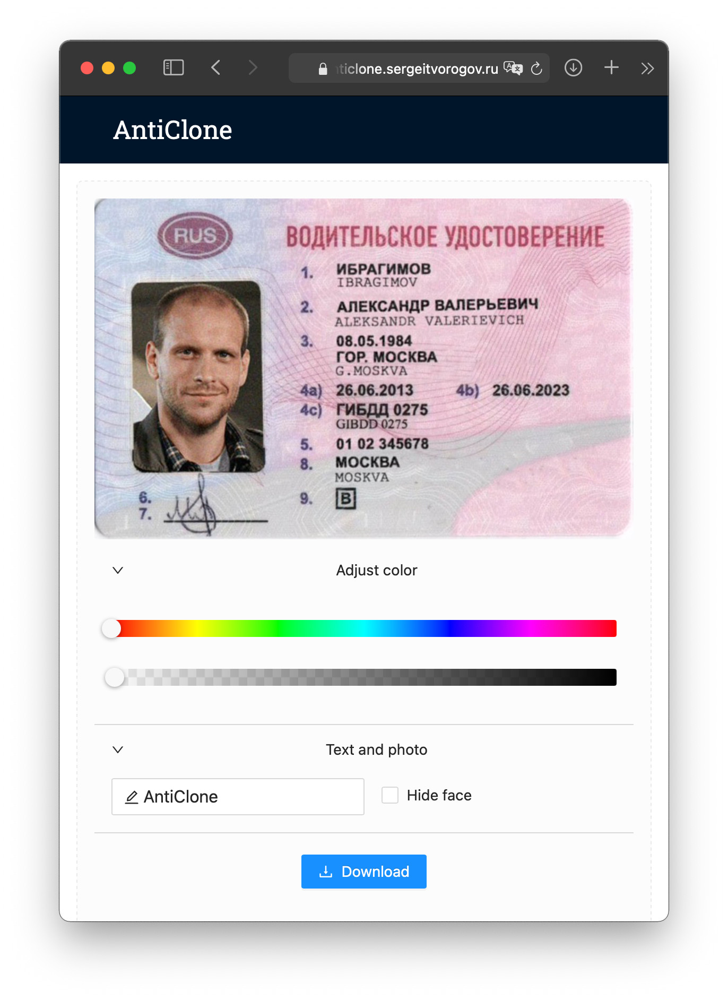
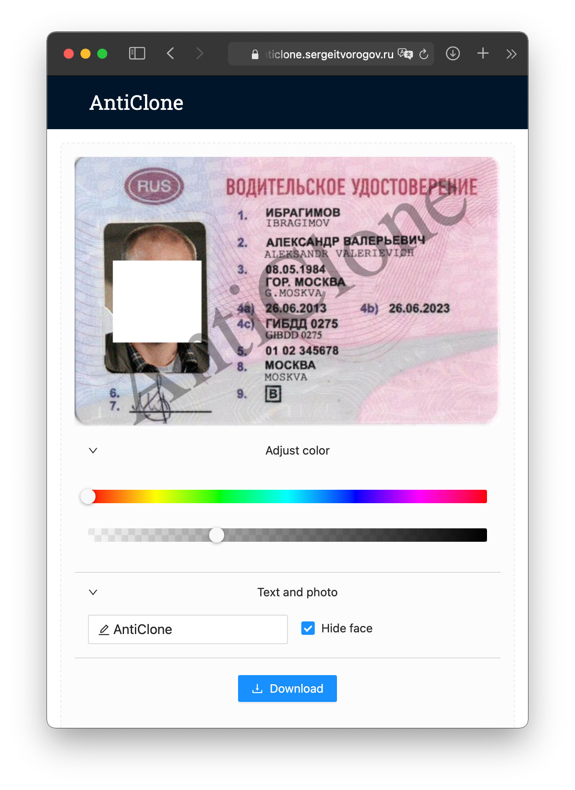

## GatsbyJS watermarking and face detection demo

Uses https://github.com/justadudewhohacks/face-api.js for face detection.

Before:|After:
:-:|:-:
|

Demo: https://anticlone.sergeitvorogov.ru

## Install:

`yarn install`

`yarn build && yarn serve`

or

`npm install`

`npm run build && npm run serve`
